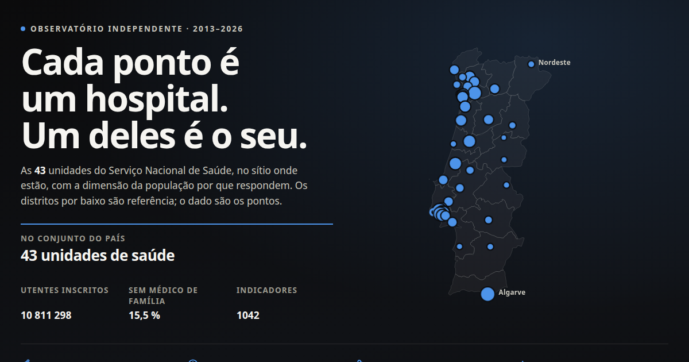

# snsRadar — O SNS, hospital a hospital (2013–2026)

**Portal:** https://sergioamsilva.github.io/snsRadar/
· [Instituições](https://sergioamsilva.github.io/snsRadar/instituicoes/)
· [Perguntas](https://sergioamsilva.github.io/snsRadar/perguntas/)
· [Metodologia](https://sergioamsilva.github.io/snsRadar/metodologia/)
· [Registo de alterações](CHANGELOG.md)



A raiz do portal é o painel de página única — `index.html` neste repositório,
4,9 MB com os dados embebidos, que abre offline e não faz um único pedido de
rede. [`dist/painel.html`](dist/painel.html) é o mesmo painel sem a navegação
do portal, para descarregar e abrir do disco.

## Resumo

O portal Transparência SNS publica 144 conjuntos de dados sobre o Serviço
Nacional de Saúde. É dos melhores acervos de dados abertos do Estado português
e é quase inútil para um cidadão: está organizado **por dataset**, e as pessoas
pensam **por instituição**.

Ninguém quer o dataset `partos-e-cesarianas`. As pessoas querem saber se a
maternidade onde vão ter um filho tem uma taxa de cesarianas de 22% ou de 45%.

O snsRadar constrói **uma página por instituição**, reunindo 52 indicadores hoje
dispersos por 22 conjuntos de dados e por um painel da ACSS sem API, cada número
com o seu denominador, a sua data, a sua fonte, e a sua comparação com o país e
com as unidades que lhe são semelhantes.

**Não é um site oficial do SNS.** É um trabalho independente sobre dados
públicos.

## Estado

Fases 0 e 1 concluídas e verificadas.

- 44 entidades canónicas, 122 chaves de nome resolvidas
- 43 fichas de instituição, 52 indicadores, 55 páginas estáticas + dados de cada ficha em JSON e CSV
- as 43 instituições com série contínua de 2013 a 2026 **atravessando a reforma
  ULS de 2024**, que parte todas as séries na fonte
- 16 verificações de integridade, todas a passar — incluindo o confronto do
  snsRadar com a ACSS **instituição a instituição e mês a mês**, em que cinco de
  sete indicadores coincidem a 100 %
  ([`reference/VALIDACAO-EXTERNA.md`](reference/VALIDACAO-EXTERNA.md))
- **segurança do doente** em seis indicadores — úlceras de pressão, sépsis e
  embolia pós-operatórias, infeção por cateter, lacerações no parto — uma
  dimensão que o Portal da Transparência não publica
- **grupos de comparação da ACSS**: cada unidade lida contra as que lhe são
  semelhantes em custo, e não só contra a mediana que junta um IPO a uma ULS
  distrital
- WCAG 2.1 AA sem violações em tema claro e escuro a 390 px; sem transbordo
  horizontal; conteúdo e gráficos legíveis sem JavaScript
- painel de página única na raiz do portal (4,9 MB, abre offline, sem CDN)
- **mortalidade ajustada ao risco** em 39 unidades (padronização indireta por
  capítulo CID, idade e sexo, com intervalo de confiança)
- **população servida** em 39 unidades, que converte contagens em taxas
  comparáveis
- **contratos públicos** em 42 unidades, a partir do registo integral do IMPIC —
  incluindo o que os contratos cresceram depois de assinados
- **contexto europeu** via Eurostat, para os indicadores que sobrevivem à
  pergunta de serem comparáveis entre países
- **ligações entre fontes que não se cruzam sozinhas**: antibióticos por mil
  dias de internamento (INFARMED × ocupação), contratos por doente padrão
  (IMPIC × ACSS), segurança confrontada com a mortalidade ajustada
- **a reforma de 2024 medida** contra as sete unidades que já eram ULS e a quem
  a lei não mudou o perímetro — um grupo de controlo, com os seus limites
  declarados
- o que mudou e quando, em [`CHANGELOG.md`](CHANGELOG.md): um número publicado
  que muda de definição tem de o dizer a quem o citou

## Porque é que os números diferem da fonte

Três correções que qualquer painel construído somando estes CSV falha. Estão
documentadas em detalhe, com verificação, em [`reference/NOTAS.md`](reference/NOTAS.md).

1. **As séries são acumuladas no ano, não mensais.** Somar os doze meses de
   `partos-e-cesarianas` dá 413 728 partos em 2024; Portugal tem cerca de
   85 000 nascimentos. O valor correto é 64 505.
2. **A reforma ULS de 2024 renomeou 32 entidades**, sete delas por fusão de
   várias numa só. Sem a tabela de correspondência curada à mão contra o
   Decreto-Lei n.º 102/2023, nenhuma série passa de 2023 para 2024.
3. **As taxas agregam-se por Σnumerador ÷ Σdenominador**, nunca pela média das
   percentagens mensais — que daria o mesmo peso a um mês com 12 partos e a um
   mês com 1200.

Que o tratamento está certo não é afirmação nossa. A ACSS publica, no seu
Benchmarking Hospitalar, os mesmos factos **mês a mês** — sem a acumulação que
obriga a esta correção. Confrontados os dois, unidade a unidade: **5 691 pares
(instituição, mês) de cesarianas, 100 % coincidentes**, numerador e denominador
incluídos. O mesmo nas fraturas da anca, na cirurgia de ambulatório, na lista de
espera e na demora antes da cirurgia. Ver
[`reference/VALIDACAO-EXTERNA.md`](reference/VALIDACAO-EXTERNA.md).

## Como correr

```bash
python3 -m venv .venv && .venv/bin/pip install duckdb pyyaml requests

.venv/bin/python atualizar.py                 # reconstrói tudo, pela ordem certa
.venv/bin/python atualizar.py --descarregar   # inclui nova ingestão da fonte
.venv/bin/python atualizar.py --site          # inclui o sítio Astro
```

Um só ponto de entrada de propósito: `enriquecer` precisa das fichas já escritas
para calcular taxas por mil habitantes, e as fichas precisam do enriquecimento
para o mostrarem — daí a dupla passagem pelo `build`. Quem corresse os passos à
mão pela ordem errada obteria fichas silenciosamente incompletas.

Atualização periódica (semanal, via `cron`):

```bash
0 6 * * 1 /caminho/para/snsRadar/scripts/atualizacao_agendada.sh
```

Lista os datasets que a fonte reviu desde a execução anterior e guarda um
registo por execução.

Painel de página única:

```bash
.venv/bin/python scripts/build_dashboard.py   # → index.html e dist/painel.html
```

Site por instituição:

```bash
cd site && npm install
npx astro build          # gera 55 páginas estáticas a partir de data/out
npx astro preview --port 4321
node scripts/verificar.mjs 4321   # acessibilidade, transbordo, sem-JS
```

Verificações restantes, também a partir de `site/`:

```bash
node scripts/verificar_dashboard.mjs ../index.html        # painel: consola, autonomia, WCAG
node scripts/verificar_coerencia.mjs                     # painel vs sítio, valor a valor
node scripts/verificar_larguras.mjs 4321                  # nenhuma página presa a uma largura fixa
node scripts/auditar.mjs                                 # peso, SEO, teclado, impressão (servidor em :4500)
```

O caminho do painel é obrigatório: o valor por omissão de
`verificar_dashboard.mjs` resolve a partir do diretório de trabalho, e corrido
de dentro de `site/` não encontraria nada.

```bash
node scripts/gerar_og.mjs   # recorta og.png da abertura (servidor em :4400)
```

## Estrutura

```
index.html                        o painel — a raiz do portal, abre offline
site/public/og.png                cartão de partilha, gerado da própria abertura
atualizar.py                      único ponto de entrada da reconstrução
scripts/atualizacao_agendada.sh   atualização periódica, com deteção de revisões
ingest/
  catalog.py            espelha o catálogo; deteta contagens erradas na fonte
  fetch.py              descarrega via /exports/csv (contorna o limite de 10k)
  benchmarking_acss.py  a segunda fonte: 45 indicadores e os grupos, sem API
  reforma.py            a reforma de 2024 medida contra um grupo de controlo
  snapshot.py           SHA-256 por dataset; deteta revisões silenciosas
  semear_crosswalk.py   rascunho do crosswalk para revisão humana
  instituicoes.py       resolução de nomes para entidades canónicas
  build.py              des-acumula, agrega e escreve as fichas
  mortalidade.py        SMR ajustado ao risco, com deteção de registo não fiável
  populacao.py          população servida por unidade (SNS + INE)
  impic.py              contratos públicos na fonte primária (IMPIC, domínio público)
  contratos.py          agrega contratos por unidade, com modificações contratuais
  eurostat.py           contexto europeu, só onde a comparação se aguenta
  segredos.py           credenciais fora da árvore do projeto, nunca no repositório
  enriquecer.py         junta SMR, população, per capita e contratos às fichas
reference/
  instituicoes.yaml            o crosswalk — a peça central
  indicadores.yaml             definição dos 52 indicadores
  entidades-nao-prestadoras.yaml
  NOTAS.md                     o que se aprendeu sobre a fonte
  VALIDACAO-EXTERNA.md         confronto com o INE e a ACSS
  referencias-externas.yaml    valores publicados por terceiros, curados à mão
tests/
  test_build.py                aritmética, des-acumulação, cautelas, fonte por valor
  test_crosswalk.py            cobertura de nomes e continuidade através de 2024
  test_validacao_externa.py    confronto com a ACSS e o INE/ERS
  test_benchmarking_acss.py    confronto com a ACSS unidade a unidade, mês a mês
data/{raw,out,snapshots,mapa}/
site/
  src/lib/dados.ts               leitura de data/out e formatação pt-PT
  src/components/Indicador.astro  o indicador como linha de boletim de análises
  src/components/Serie.astro      série mensal em SVG, renderizada no servidor
  src/components/Funil.astro      funnel plot: distingue o desempenho do acaso
  src/components/Declive.astro    duas medidas ligadas, unidade a unidade
  src/components/Ranking.astro    volume cirúrgico, ordenado, país inteiro
  src/components/Cruzamento.astro dois indicadores cruzados, com cautela ecológica
  src/components/Mapa.astro       o continente, em SVG
  src/components/Contexto.astro   comparação com a Europa (Eurostat)
  src/components/Movimento.astro  contratos: volume, via e modificações
  src/components/Triagem.astro    urgências por prioridade de Manchester
  src/pages/                      perguntas, homepage, fichas, metodologia
  scripts/verificar.mjs           acessibilidade, transbordo, sem-JavaScript
  scripts/verificar_dashboard.mjs acessibilidade, autonomia e consola do painel
  scripts/verificar_coerencia.mjs coerência entre as duas implementações
  scripts/auditar.mjs             peso, SEO, teclado, impressão, tipografia
web/
  template.html                   painel: estrutura e estilos
  app.js                          painel: agregação e desenho, no navegador
scripts/build_dashboard.py        embebe dados e lógica → index.html
site/scripts/gerar_og.mjs         recorta og.png da abertura do sítio
dist/painel.html                  o painel sem navegação, para abrir do disco
.github/workflows/publicar.yml    constrói e publica no GitHub Pages
```

## Dois formatos, o mesmo pipeline

**`index.html`** — painel de página única, na forma do csmRadar: um ficheiro
com os dados embebidos, que abre offline e não faz um único pedido de rede. É a
raiz do portal.
Filtros por período e região refletidos no endereço, evolução nacional,
dispersão de todas as unidades face à mediana, mapa do continente, tabela
ordenável, ficha por unidade partilhável via `#inst=uls-coimbra`, glossário e
exportação de gráficos em PNG.

**`site/`** — sítio estático com uma página por instituição, legível sem
JavaScript, para quem chega por pesquisa à procura do seu hospital.

Ambos leem de `data/out` e das mesmas regras: o que muda é a forma de leitura.

## O site

Uma página por instituição. Cada indicador é apresentado como uma linha de
boletim de análises — valor, escala, intervalo de referência — porque um número
de saúde nunca se lê sozinho. A comparação é sempre contra a mediana das
instituições, e contra a referência externa quando existe.

Estático por princípio: um portal cívico tem de sobreviver sem orçamento. Não
há servidor nem base de dados; os gráficos são SVG gerado no servidor, legíveis
sem JavaScript.

## Regras que o código impõe

Não são recomendações; falham o build ou os testes.

1. Nenhuma percentagem sem o seu par de contagens; agregação sempre Σnum÷Σden.
2. Denominador abaixo de 20 não gera taxa.
3. Meses em falta são lacunas, nunca zeros. Uma des-acumulação que não seja
   fiável produz ausência de valor, não um valor inventado.
4. Cada valor traz o dataset de origem, a data de atualização da fonte e uma
   URL da API que o reproduz.
5. Indicadores não ajustados ao risco — cesarianas, mortalidade por AVC,
   ocupação — levam obrigatoriamente texto de cautela.
6. Todo o nome de instituição usado pela fonte tem de resolver para uma
   entidade canónica ou constar da lista de entidades não prestadoras. Sem
   limiares: um limiar deixou passar «Centro Hospitalar Cova da Beira» e
   «Hospital Garcia de Orta - Almada» na primeira tentativa.
7. Meses cujo volume nacional cai abaixo de 80 % da mediana são descartados
   (`exigir_mes_completo`). Um denominador incompleto com numerador completo
   inventa picos que não existem — ver a secção 14 de
   [`reference/NOTAS.md`](reference/NOTAS.md).
8. Cobertura insuficiente declara-se, não se disfarça. Uma unidade que reporte
   mal os seus contratos não aparece como uma unidade que gasta pouco: o total
   fica escondido e a razão fica escrita.
9. Quando a fonte se contradiz, o período fica declarado no indicador e impresso
   pelo teste — nunca dissolvido numa tolerância maior para todos. É o caso dos
   internamentos longos em 2013 e 2014, em que a ACSS publica uma taxa que não
   bate com as contagens que publica ao lado.
10. Uma mediana de grupo com menos de cinco unidades não se publica. Numa
    mediana de três, cada unidade é um terço da referência contra a qual está a
    ser lida.

## Fontes

Dados de `transparencia.sns.gov.pt`, publicados por ACSS, DE-SNS, INFARMED,
SPMS e INEM. Correspondência de entidades verificada contra o Decreto-Lei
n.º 102/2023, de 7 de novembro (Diário da República, 1.ª série, n.º 215).

Fora do portal: o **Benchmarking Hospitalar da ACSS**
(`benchmarking-acss.min-saude.pt`), de onde vêm a segurança do doente, o volume
cirúrgico, as métricas por doente padrão e os grupos de comparação; contratos
públicos do **IMPIC** via `dados.gov.pt`, em domínio público declarado
(`other-pd`); população residente do **INE**; contexto europeu da API aberta do
**Eurostat**.

O Benchmarking não tem API nem licença declarada, e a sua situação jurídica é
**mais frágil** do que a do portal de transparência — a posição adotada e o que
a distingue estão em [`ATRIBUICAO.md`](ATRIBUICAO.md). O que se aprendeu a ler
uma fonte sem contrato de leitura está na secção final de
[`reference/NOTAS.md`](reference/NOTAS.md): a rota de exportação que varia por
indicador e devolve ficheiros vazios em vez de erros, o ano que vinha a dobrar
sob dois nomes, e os meses que a fonte serve sem os anunciar.

A situação jurídica da reutilização dos dados do portal do SNS está por
resolver — ver [`ATRIBUICAO.md`](ATRIBUICAO.md) para a posição adotada e a
secção final de [`reference/NOTAS.md`](reference/NOTAS.md) para o que falta.

## Atualização

**Última extração de dados: 2 de agosto de 2026.** O catálogo do portal tem 144
conjuntos; destes, 26 são descarregados e guardados com a sua impressão digital,
e 19 alimentam as fichas. Desses 19, a fonte reviu o mais antigo a 17 de junho e
o mais recente a 1 de agosto de 2026.

O que cada camada cobre não é o mesmo, porque as fontes não publicam ao mesmo
ritmo — e um portal que apresentasse tudo como se fosse do mesmo dia estaria a
mentir por omissão:

| Camada | Cobertura |
|---|---|
| Séries mensais | janeiro de 2013 a junho de 2026 |
| Valor grande de cada indicador | 12 meses até maio de 2026 |
| Benchmarking da ACSS | janeiro de 2013 a maio de 2026 |
| Gastos por doente padrão (SNC-AP) | janeiro de 2018 a maio de 2026 |
| Triagem das urgências | junho de 2025 a maio de 2026 |
| População servida | junho de 2026 |
| Contratos públicos (IMPIC) | 2012 a 2026 |
| Mortalidade ajustada ao risco | janeiro de 2021 a outubro de 2025 |
| Contexto europeu (Eurostat) | 2023 |

O conjunto atualiza-se ao ritmo da fonte, que revê os dados mensalmente — 94
dos 144 conjuntos foram revistos em julho de 2026. A verificação semanal corre
por `cron` ([`scripts/atualizacao_agendada.sh`](scripts/atualizacao_agendada.sh)),
lista os conjuntos que a fonte alterou desde a execução anterior e guarda o
`SHA-256` de cada um em [`data/snapshots/`](data/snapshots/) — é assim que se
deteta uma revisão silenciosa, em que a fonte muda números sem mudar a data.

A publicação não é automática a partir daí: atualizar os números é correr
`atualizar.py` e fazer commit do que mudou. Num portal que publica indicadores
de saúde, a revisão humana fica no meio do caminho de propósito.

## Citação sugerida

> snsRadar — O SNS, hospital a hospital, 2013–2026. Compilação a partir do
> Portal da Transparência do SNS (ACSS, DE-SNS, INFARMED, SPMS e INEM), do
> registo de contratos públicos do IMPIC, do INE e do Eurostat. Disponível em
> https://sergioamsilva.github.io/snsRadar/ (consultado em [data]).

Não é um serviço oficial do SNS. Ao citar um número em concreto, vale a pena
usar a ligação «ver este número na fonte» que acompanha cada valor: reproduz a
consulta à API que lhe deu origem, e é o que permite a quem o ler verificá-lo
sem passar por aqui.

## Licença

Código e ficheiros de referência sob licença [MIT](LICENSE). Os dados originais
permanecem dos organismos que os publicam.

## Contribuições

A ligação ao **Benchmarking Hospitalar da ACSS** — a segunda fonte de
indicadores deste portal, de onde vêm a dimensão de segurança do doente, o
volume cirúrgico, as métricas por doente padrão e os grupos de comparação — foi
sugerida por **[Tomás Araújo](https://www.linkedin.com/in/tom%C3%A1s-ara%C3%BAjo99/)**.

Foi dele também a pergunta que deu origem à comparação dentro de cada grupo:
«não achas que dava para comparar hospitais dentro do mesmo cluster?». Dava — e
mudou vereditos. A sépsis pós-operatória corre a 3,7 ‰ no Grupo B e a 11,1 ‰ no
Grupo E: um hospital do Grupo B com 5 ‰ parecia bom contra a mediana do país e é
mau contra os seus pares. Ver [`CHANGELOG.md`](CHANGELOG.md).

## Contacto

**radar@cybersec.pt**

Correções são bem-vindas e são o motivo de tudo trazer fonte: se um número desta
página não bate certo com o da sua instituição, a ligação «ver este número na
fonte» reproduz a consulta que lhe deu origem. Se o erro for nosso, queremos
sabê-lo; se for da fonte, ajuda-nos a documentá-lo em
[`reference/NOTAS.md`](reference/NOTAS.md).
